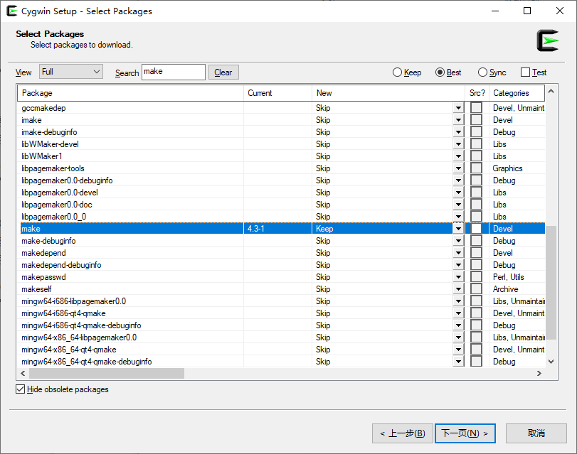
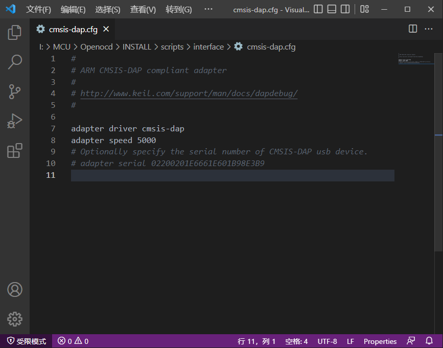
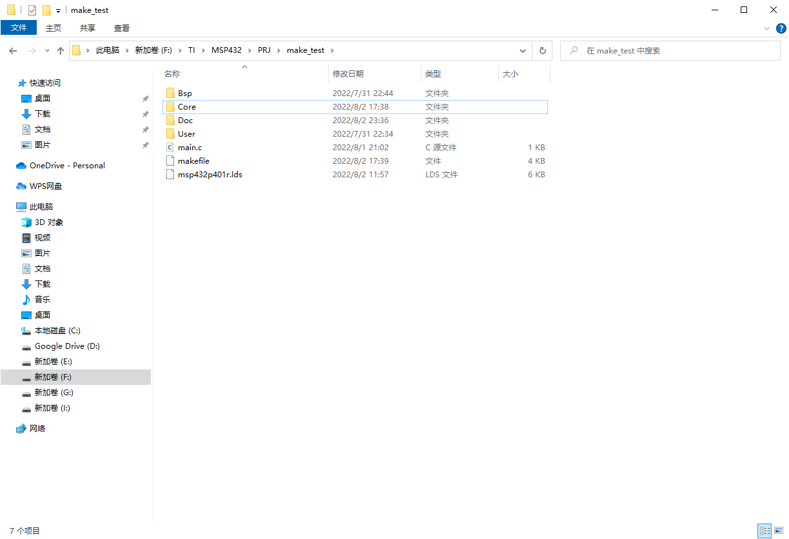
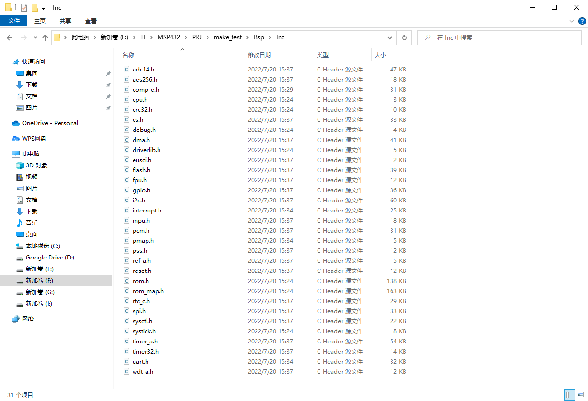
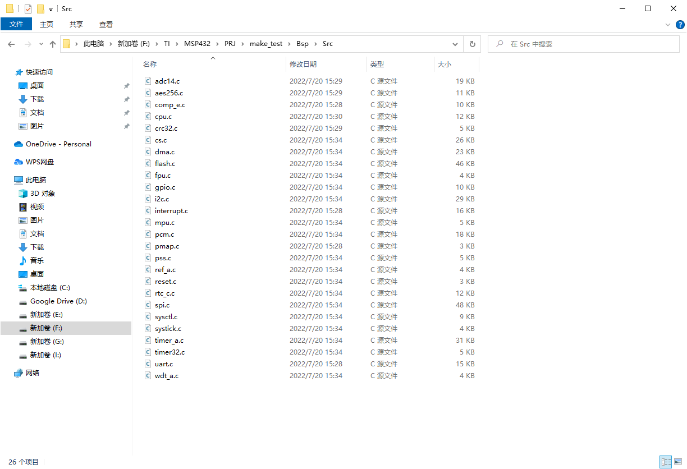
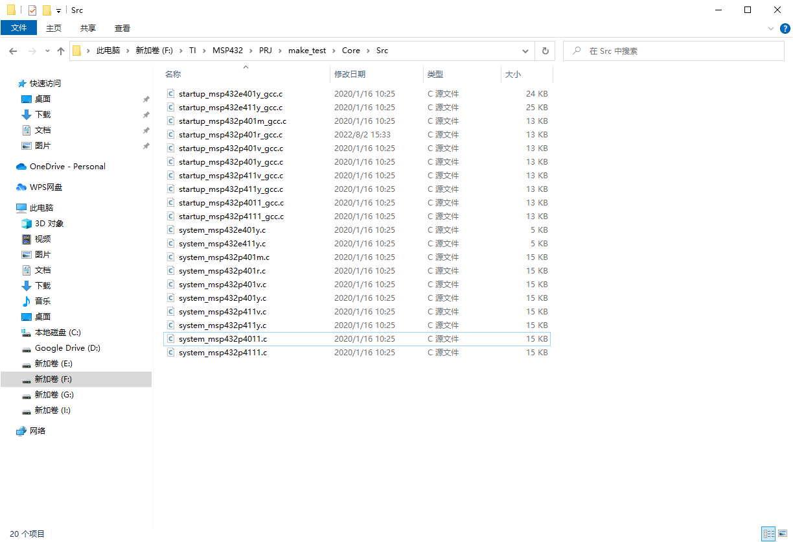

# Windows下使用makefile + GNU tools for arm + Openocd 开发MSP432P401R

## 写在前面

正式开始前，我想说一下为何要抛弃Windows一些优秀的IDE，而使用复杂的make来开发。一开始拿到这块开发板的时候，我是用TI官方的CCS（Code Composer Studio）来点灯的。但是我发现这款IDE做的并不是很优秀，体验感并不是很好，具体就是代码补全不如其他的IDE，工程的创建也不如RTT的IDE（RT-Thread Studio）。在网上搜索开发环境后，发现大家有的用MDK，有的用IAR，还有用eclipse的（文末细嗦）。无一例外，都是IDE，然而我想折腾一下，想要了解IDE“一键编译”的背后，熟悉底层的原理，所以我选择了makefile，同时搭配VScode的编辑功能来开发。

## 目录

1.  简介
   * Makefile 
   * GNU tools for arm
   * Openocd
2.  开发环境搭建
   * GNU tools for arm 工具的安装
   * make 工具的安装
   * Openocd 的安装
     * .cfg文件配置
   * VScode 的安装
   * Simplelink库下载
   * 新建点灯工程
     * makefile的编写
     * 链接脚本文件的修改
     * 编写点灯代码
3.  结语

## 一、简介

* ### Makefile

  >  简单来说，Makefile就是一个辅助工具，它可以根据设定来执行一些指令，这些指令是在命令行窗口或是shell里执行的。它就像一个脚本，一旦编写完，只需要在一个make命令，就可以完成整个工程的编译。具体语法请大家自行百度，或者参照我文末给出的文档--跟我一起写Makefile。在大家了解学习makefile之前，我想一些基础的C语言编译链接的知识是需要的。

* ### GNU tools for arm

  >  对于GCC，大家可能并不陌生，它是编译源代码的工具，全称叫GNU Compiler Collection，而这个GNU的全称是GNU's Not UNIX，是GNU的递归缩写。对GNU计划感兴趣的同学可以百度一下GNU，很有意思。回归正题，这个tools for arm也叫交叉编译链，交叉是因为windows/linux的架构和arm不一样，要在x86架构上的主机编译能够在arm架构的机子运行的可执行文件，就要用到交叉编译链。而如果在本机编译出本机的可执行文件，就用不着”交叉“了。有了这个tools，我们才能将写出来的源文件编译成可在msp432上运行的可执行文件。

* ### Openocd

  > Openocd 是一个功能强大的软件调试器，并不仅仅可以实现单片机程序的烧录。使用时需配备仿真器如STlink、Jlink或者DAPlink等。Openocd配合cross tools的gdb工具就可以实现对单片机的调试。

## 二、开发环境搭建

* ### GNU tools for arm 工具的安装

  >  在官网获取安装包后，双击。根据提示，可以安装在自己指定的文件夹中并记下安装路径，建议在一个总文件夹下存放交叉工具链和make工具的安装。
  >
  >  可以在此链接找到安装包[Arm GNU Toolchain | Arm GNU Toolchain Downloads – Arm Developer](https://developer.arm.com/tools-and-software/open-source-software/developer-tools/gnu-toolchain/downloads)
  >
  >  下载Windows (mingw-w64-i686) hosted cross toolchains下的[gcc-arm-11.2-2022.02-mingw-w64-i686-arm-none-eabi.exe](https://developer.arm.com/-/media/Files/downloads/gnu/11.2-2022.02/binrel/gcc-arm-11.2-2022.02-mingw-w64-i686-arm-none-eabi.exe)
  >
  >  安装后将安装路径下的bin文件夹添加到环境变量中。

* ### make 工具的安装

  >  在官网获取安装包后，双击打开。选择安装路径后一路next，直到选择packages选项。
  >
  >  
  >
  >  在make 的new 一栏选择最新版本，之后一路next，并记下安装路径。将安装路径下的bin文件夹添加到环境变量中。
  >
  >  可以在此链接获取安装包[setup-x86_64.exe](https://www.cygwin.com/setup-x86_64.exe)

* ### Openocd 的安装

  > Openocd可以在github上获取。
  >
  > [xpack-openocd-0.11.0-4-win32-x64.zip](https://github.com/xpack-dev-tools/openocd-xpack/releases/download/v0.11.0-4/xpack-openocd-0.11.0-4-win32-x64.zip)
  >
  > 选择一个路径直接解压，无需安装，并记下解压路径。将解压路径下的bin文件夹添加到环境变量中。
  >
  > 找到安装路径，进入scripts，进入interface，根据你所选的仿真器打开对应的.cfg文件，在其中添加`adapter speed 5000`。时钟也可以根据你的需求来配置。如：
  >
  > 

* ### VScode 的安装

  >  这个比较简单，官网获取安装包后傻瓜式安装就可以。（全称Visual Studio Code）
  >
  >  可以在此链接获取安装包[direct download link](https://code.visualstudio.com/sha/download?build=stable&os=win32-x64-user)

* ### Simplelink库下载

  >  simplelink是ti官方推出的SDK，有对应不同开发板的版本，我们可以到官网（www.ti.com）搜索simplelink msp432的版本。下载完后解压得到一个simplelink_msp432p4_sdk_3_40_01_02的文件夹，里面存放的就是一些官方的例程和所需的头文件和链接脚本文件，还有全部的配置外设的库。例程在examples目录下，头文件在source\ti\devices\msp432p4xx\inc目录下，库文件在\source\ti\devices\msp432p4xx\driverlib目录下，还有必需的启动文件和系统初始化文件在\source\ti\devices\msp432p4xx\startup_system_files目录下。
  >
  > 可以在此链接获取安装包[SIMPLELINK-MSP432-SDK Software development kit (SDK) | TI.com](https://www.ti.com/tool/download/SIMPLELINK-MSP432-SDK)
  >
  > [lockWindows Installer for SimpleLink MSP432P4 SDK — 237908 K](https://dr-download.ti.com/software-development/software-development-kit-sdk/MD-dSV82B3Lb6/3.40.01.02/simplelink_msp432p4_sdk_3_40_01_02.exe)

* ### 新建点灯工程

  >  我们开始建立一个新工程。先建立一个总的工程文件夹，以后开发的别的工程文件夹可放在这个总文件夹里，也可称为工作区。在工作区内新建工程文件夹make_test，工程文件夹下新建四个文件夹Bsp，User，Core和Doc，其中Bsp用来存放板级支持包（也就是simplelink里配置外设的库文件）；User用来存放用户（也就是我们自己）写的代码，例如点灯的代码；Core用来存放与cortex内核有关的文件和官方给的关于msp432的一些文件；Doc用来存放文档；最外层可以放链接文件，makefile等与编译链接有关的文件。
  >
  >  具体如下：
  >
  >  工程文件夹make_test
  >
  >  
  >
  >  Bsp文件夹
  >
  >  将simple的\source\ti\devices\msp432p4xx\driverlib文件夹下的.c和.h文件复制进来，并分为头文件和源文件。
  >
  >  
  >
  >  
  >
  >  Core文件夹分为Include和Src两个文件夹，其中
  >
  >  Inc：在simplelink里的source\ti\devices\msp432p4xx\inc目录下复制进来所需文件。
  >
  >  
  >
  >  
  >
  >  Src：在source\ti\devices\msp432p4xx\startup_system_files下找到所需源文件并复制进来。
  >
  >  
  >
  >  User暂时不需要存放文件，点灯代码直接写在main.c里。
  >
  >  Doc也暂时不需要。
  >
  >  最后在simplelink的source\ti\devices\msp432p4xx\linker_files\gcc下找到p401r的.lds文件，复制到工程文件夹下，同时新建main.c文件和makefile文件。
  >
  >  > * makefile 的编写
  >  >
  >  >   这个需要注意，如果按照上面的步骤配置完后，C_SOURCES和C_INCLUDES不用改，需要更改的是最后`make connect`后面的参数，-f后要根据自己的解压路径来。
  >  >
  >  >   ```makefile
  >  >   #2022/7/31 22:56
  >  >   #make-test
  >  >
  >  >     #fake target define
  >  >   .PHONY: clean connect
  >  >
  >  >     #define tools
  >  >   PREFIX = arm-none-eabi-
  >  >   # The gcc compiler bin path can be either defined in make command via GCC_PATH variable (> make GCC_PATH=xxx)
  >  >   # either it can be added to the PATH environment variable.
  >  >   ifdef GCC_PATH
  >  >   CC = $(GCC_PATH)/$(PREFIX)gcc
  >  >   AS = $(GCC_PATH)/$(PREFIX)gcc -x assembler-with-cpp
  >  >   CP = $(GCC_PATH)/$(PREFIX)objcopy
  >  >   SZ = $(GCC_PATH)/$(PREFIX)size
  >  >   LD = $(GCC_PATH)/$(PREFIX)ld
  >  >   else
  >  >   CC = $(PREFIX)gcc
  >  >   AS = $(PREFIX)gcc -x assembler-with-cpp
  >  >   CP = $(PREFIX)objcopy
  >  >   SZ = $(PREFIX)size
  >  >   LD = $(PREFIX)ld
  >  >   endif
  >  >
  >  >     # cpu
  >  >   CPU = -mcpu=cortex-m4
  >  >
  >  >     # fpu
  >  >   FPU = -mfpu=fpv4-sp-d16
  >  >
  >  >     # float-abi
  >  >   FLOAT-ABI = -mfloat-abi=hard
  >  >
  >  >     # mcu
  >  >   MCU = $(CPU) -mthumb $(FPU) $(FLOAT-ABI)
  >  >
  >  >     #define project name
  >  >   PRJ_NAME = make_test
  >  >   #build, contents obj file
  >  >   BUILD_DIR = build
  >  >
  >  >     #sources
  >  >   C_SOURCES = \
  >  >   /Bsp/Src/adc14.c \
  >  >   /Bsp/Src/aes256.c \
  >  >   /Bsp/Src/comp_e.c \
  >  >   /Bsp/Src/cpu.c \
  >  >   /Bsp/Src/crc32.c \
  >  >   /Bsp/Src/cs.c \
  >  >   /Bsp/Src/dma.c \
  >  >   /Bsp/Src/flash.c \
  >  >   /Bsp/Src/fpu.c \
  >  >   /Bsp/Src/gpio.c \
  >  >   /Bsp/Src/i2c.c \
  >  >   /Bsp/Src/interrupt.c \
  >  >   /Bsp/Src/mpu.c \
  >  >   /Bsp/Src/pcm.c \
  >  >   /Bsp/Src/pmap.c \
  >  >   /Bsp/Src/pss.c \
  >  >   /Bsp/Src/ref_a.c \
  >  >   /Bsp/Src/reset.c \
  >  >   /Bsp/Src/rtc_c.c \
  >  >   /Bsp/Src/spi.c \
  >  >   /Bsp/Src/sysctl.c \
  >  >   /Bsp/Src/systick.c \
  >  >   /Bsp/Src/timer32.c \
  >  >   /Bsp/Src/timer_a.c \
  >  >   /Bsp/Src/uart.c \
  >  >   /Bsp/Src/wdt_a.c\
  >  >   /Core/Src/startup_msp432p401r_gcc.c \
  >  >   /Core/Src/system_msp432p401r.c \
  >  >   /main.c \
  >  >   #defines
  >  >   C_DEFS = \
  >  >   -D__MSP432P401R__ \
  >  >   -Dgcc \
  >  >
  >  >     #includes
  >  >   C_INCLUDES = \
  >  >   -ICore/Include \
  >  >   -ICore/Include/CMSIS \
  >  >   -IBsp/Inc 
  >  >   #-ICore/tools/ti-cgt-arm_20.2.6.LTS/include 
  >  >   #-ICore/tools/ti-cgt-arm_20.2.6.LTS/lib 
  >  >
  >  >     #lib link
  >  >   LIB = -lc -lm -lnosys \
  >  >   #-LF:\TI\MSP432\PRJ\make_test\Core\tools\ti-cgt-arm_20.2.6.LTS\lib \
  >  >   -LI:\MCU\GNU_tools_ARM\arm-none-eabi\lib\armv7-m \
  >  >   -LI:\MCU\GNU_tools_ARM\lib\gcc\arm-none-eabi\5.4.1\armv7-m \
  >  >   -LI:\MCU\GNU_tools_ARM\lib\gcc\arm-none-eabi\5.4.1\fpu \
  >  >
  >  >     #link options
  >  >   LDFLAGS = $(MCU) -Tmsp432p401r.lds -specs=nosys.specs $(LIB) -Wl,-gc-sections,--cref -Wl,-Map=$(BUILD_DIR)/$(PRJ_NAME).map#-nostdlib
  >  >   #compile options
  >  >   CCFLAGS = -c -g $(MCU) $(C_DEFS) $(C_INCLUDES) #
  >  >
  >  >     #path define
  >  >   VPATH = \
  >  >   Core/Include:Core/Include/CMSIS:Bsp/Inc:\
  >  >   Bsp/Src:Core/Src/:\
  >  >
  >  >   OBJECTS = $(addprefix $(BUILD_DIR)/,$(notdir $(C_SOURCES:.c=.o)))
  >  >   #vpath %.c $(sort $(dir $(C_SOURCES)))
  >  >   #OBJECTS += \
  >  >   I:\MCU\GNU_tools_ARM\arm-none-eabi\lib\armv7-m\crt0.o \
  >  >   I:\MCU\GNU_tools_ARM\lib\gcc\arm-none-eabi\5.4.1\armv7-m\crti.o \
  >  >   I:\MCU\GNU_tools_ARM\lib\gcc\arm-none-eabi\5.4.1\armv7-m\crtbegin.o \
  >  >
  >  >   all: $(BUILD_DIR)/$(PRJ_NAME).elf $(BUILD_DIR)/$(PRJ_NAME).bin
  >  >
  >  >   $(BUILD_DIR)/$(PRJ_NAME).elf: $(OBJECTS)
  >  >   $(CC) $(OBJECTS) $(LDFLAGS) -o $@
  >  >   $(SZ) $@
  >  >
  >  >   $(BUILD_DIR)/$(PRJ_NAME).bin: $(BUILD_DIR)/$(PRJ_NAME).elf
  >  >   $(CP) $< -O binary $@
  >  >
  >  >   $(BUILD_DIR)/%.o: %.c makefile | $(BUILD_DIR)
  >  >   $(CC) $(CCFLAGS) $< -o $@
  >  >
  >  >   $(BUILD_DIR):
  >  >   mkdir $@
  >  >
  >  >   clean:
  >  >   rm -f $(BUILD_DIR)/*.o $(BUILD_DIR)/*.elf $(BUILD_DIR)/*.bin
  >  >   connect:
  >  >     	openocd -f I:\MCU\Openocd\INSTALL\scripts\interface\cmsis-dap.cfg -f I:\MCU\Openocd\INSTALL\scripts\target\ti_msp432.cfg
  >  >
  >  > * 链接脚本文件修改
  >  >
  >  > 	 只需在开头添加`ENTRY(Reset_Handler)`指定程序入口即可。
  >  >
  >  > 	```linkscripts
  >  > 	  /******************************************************************************
  >  > 	  *
  >  > 	 * Copyright (C) 2012 - 2017 Texas Instruments Incorporated - http://www.ti.com/
  >  > 	  *
  >  > 	  * Redistribution and use in source and binary forms, with or without
  >  > 	 * modification, are permitted provided that the following conditions
  >  > 	  * are met:
  >  > 	  *
  >  > 	 *  Redistributions of source code must retain the above copyright
  >  > 	  *  notice, this list of conditions and the following disclaimer.
  >  > 	  *
  >  > 	 *  Redistributions in binary form must reproduce the above copyright
  >  > 	  *  notice, this list of conditions and the following disclaimer in the
  >  > 	  *  documentation and/or other materials provided with the
  >  > 	  *  distribution.
  >  > 	  *
  >  > 	 *  Neither the name of Texas Instruments Incorporated nor the names of
  >  > 	 *  its contributors may be used to endorse or promote products derived
  >  > 	  *  from this software without specific prior written permission.
  >  > 	  *
  >  > 	  * THIS SOFTWARE IS PROVIDED BY THE COPYRIGHT HOLDERS AND CONTRIBUTORS
  >  > 	  * "AS IS" AND ANY EXPRESS OR IMPLIED WARRANTIES, INCLUDING, BUT NOT
  >  > 	  * LIMITED TO, THE IMPLIED WARRANTIES OF MERCHANTABILITY AND FITNESS FOR
  >  > 	  * A PARTICULAR PURPOSE ARE DISCLAIMED. IN NO EVENT SHALL THE COPYRIGHT
  >  > 	  * OWNER OR CONTRIBUTORS BE LIABLE FOR ANY DIRECT, INDIRECT, INCIDENTAL,
  >  > 	  * SPECIAL, EXEMPLARY, OR CONSEQUENTIAL DAMAGES (INCLUDING, BUT NOT
  >  > 	  * LIMITED TO, PROCUREMENT OF SUBSTITUTE GOODS OR SERVICES; LOSS OF USE,
  >  > 	  * DATA, OR PROFITS; OR BUSINESS INTERRUPTION) HOWEVER CAUSED AND ON ANY
  >  > 	  * THEORY OF LIABILITY, WHETHER IN CONTRACT, STRICT LIABILITY, OR TORT
  >  > 	  * (INCLUDING NEGLIGENCE OR OTHERWISE) ARISING IN ANY WAY OUT OF THE USE
  >  > 	  * OF THIS SOFTWARE, EVEN IF ADVISED OF THE POSSIBILITY OF SUCH DAMAGE.
  >  > 	  *
  >  > 	  * GCC linker script for Texas Instruments MSP432P401R
  >  > 	  *
  >  > 	  * File creation date: 12/06/17
  >  > 	  *
  >  > 	  ******************************************************************************/
  >  > 	  ENTRY(Reset_Handler)
  >  > 			
  >  > 	  MEMORY
  >  > 	  {
  >  > 	      MAIN_FLASH (RX) : ORIGIN = 0x00000000, LENGTH = 0x00040000
  >  > 	      INFO_FLASH (RX) : ORIGIN = 0x00200000, LENGTH = 0x00004000
  >  > 	      SRAM_CODE  (RWX): ORIGIN = 0x01000000, LENGTH = 0x00010000
  >  > 	      SRAM_DATA  (RW) : ORIGIN = 0x20000000, LENGTH = 0x00010000
  >  > 	  }
  >  > 			
  >  > 	  REGION_ALIAS("REGION_TEXT", MAIN_FLASH);
  >  > 	  REGION_ALIAS("REGION_INFO", INFO_FLASH);
  >  > 	  REGION_ALIAS("REGION_BSS", SRAM_DATA);
  >  > 	  REGION_ALIAS("REGION_DATA", SRAM_DATA);
  >  > 	  REGION_ALIAS("REGION_STACK", SRAM_DATA);
  >  > 	  REGION_ALIAS("REGION_HEAP", SRAM_DATA);
  >  > 	  REGION_ALIAS("REGION_ARM_EXIDX", MAIN_FLASH);
  >  > 	  REGION_ALIAS("REGION_ARM_EXTAB", MAIN_FLASH);
  >  > 	   SECTIONS {
  >  > 			
  >  > 	      /* section for the interrupt vector area                                 */
  >  > 	      PROVIDE (_intvecs_base_address =
  >  > 	          DEFINED(_intvecs_base_address) ? _intvecs_base_address : 0x0);
  >  > 			
  >  > 	      .intvecs (_intvecs_base_address) : AT (_intvecs_base_address) {
  >  > 	          KEEP (*(.intvecs))
  >  > 	      } > REGION_TEXT
  >  > 			
  >  > 	      /* The following three sections show the usage of the INFO flash memory  */
  >  > 	      /* INFO flash memory is intended to be used for the following            */
  >  > 	      /* device specific purposes:                                             */
  >  > 	      /* Flash mailbox for device security operations                          */
  >  > 	      PROVIDE (_mailbox_base_address = 0x200000);
  >  > 			
  >  > 	      .flashMailbox (_mailbox_base_address) : AT (_mailbox_base_address) {
  >  > 	          KEEP (*(.flashMailbox))
  >  > 	      } > REGION_INFO
  >  > 			
  >  > 	      /* TLV table for device identification and characterization              */
  >  > 	      PROVIDE (_tlv_base_address = 0x00201000);
  >  > 			
  >  > 	      .tlvTable (_tlv_base_address) (NOLOAD) : AT (_tlv_base_address) {
  >  > 	          KEEP (*(.tlvTable))
  >  > 	      } > REGION_INFO
  >  > 			
  >  > 	      /* BSL area for device bootstrap loader                                  */
  >  > 	      PROVIDE (_bsl_base_address = 0x00202000);
  >  > 			
  >  > 	      .bslArea (_bsl_base_address) : AT (_bsl_base_address) {
  >  > 	          KEEP (*(.bslArea))
  >  > 	      } > REGION_INFO
  >  > 			
  >  > 	      PROVIDE (_vtable_base_address =
  >  > 	          DEFINED(_vtable_base_address) ? _vtable_base_address : 0x20000000);
  >  > 			
  >  > 	      .vtable (_vtable_base_address) : AT (_vtable_base_address) {
  >  > 	          KEEP (*(.vtable))
  >  > 	      } > REGION_DATA
  >  > 			
  >  > 	      .text : {
  >  > 	          CREATE_OBJECT_SYMBOLS
  >  > 	          KEEP (*(.text))
  >  > 	          *(.text.*)
  >  > 	          . = ALIGN(0x4);
  >  > 	          KEEP (*(.ctors))
  >  > 	          . = ALIGN(0x4);
  >  > 	          KEEP (*(.dtors))
  >  > 	          . = ALIGN(0x4);
  >  > 	          __init_array_start = .;
  >  > 	          KEEP (*(.init_array*))
  >  > 	          __init_array_end = .;
  >  > 	          KEEP (*(.init))
  >  > 	          KEEP (*(.fini*))
  >  > 	      } > REGION_TEXT AT> REGION_TEXT
  >  > 			
  >  > 	      .rodata : {
  >  > 	          *(.rodata)
  >  > 	          *(.rodata.*)
  >  > 	      } > REGION_TEXT AT> REGION_TEXT
  >  > 			
  >  > 	      .ARM.exidx : {
  >  > 	          __exidx_start = .;
  >  > 	          *(.ARM.exidx* .gnu.linkonce.armexidx.*)
  >  > 	          __exidx_end = .;
  >  > 	      } > REGION_ARM_EXIDX AT> REGION_ARM_EXIDX
  >  > 			
  >  > 	      .ARM.extab : {
  >  > 	          KEEP (*(.ARM.extab* .gnu.linkonce.armextab.*))
  >  > 	      } > REGION_ARM_EXTAB AT> REGION_ARM_EXTAB
  >  > 			
  >  > 	      __etext = .;
  >  > 			
  >  > 	      .data : {
  >  > 	          __data_load__ = LOADADDR (.data);
  >  > 	          __data_start__ = .;
  >  > 	          KEEP (*(.data))
  >  > 	          KEEP (*(.data*))
  >  > 	          . = ALIGN (4);
  >  > 	          __data_end__ = .;
  >  > 	      } > REGION_DATA AT> REGION_TEXT
  >  > 			
  >  > 	      .bss : {
  >  > 	          __bss_start__ = .;
  >  > 	          *(.shbss)
  >  > 	          KEEP (*(.bss))
  >  > 	          *(.bss.*)
  >  > 	          *(COMMON)
  >  > 	          . = ALIGN (4);
  >  > 	          __bss_end__ = .;
  >  > 	      } > REGION_BSS AT> REGION_BSS
  >  > 			
  >  > 	      .heap : {
  >  > 	          __heap_start__ = .;
  >  > 	          end = __heap_start__;
  >  > 	          _end = end;
  >  > 	          __end = end;
  >  > 	          KEEP (*(.heap))
  >  > 	          __heap_end__ = .;
  >  > 	          __HeapLimit = __heap_end__;
  >  > 	      } > REGION_HEAP AT> REGION_HEAP
  >  > 			
  >  > 	      .stack (NOLOAD) : ALIGN(0x8) {
  >  > 	          _stack = .;
  >  > 	          KEEP(*(.stack))
  >  > 	      } > REGION_STACK AT> REGION_STACK
  >  > 			
  >  > 	  	__StackTop = ORIGIN(REGION_STACK) + LENGTH(REGION_STACK);
  >  > 	      PROVIDE(__stack = __StackTop);
  >  > 	  }
  >  > 	```
  >  >
  >  > 
  >  >
  >  > * 编写点灯代码
  >  >
  >  >   这一部分用到了simplelink库。
  >  >
  >  >   ```c
  >  >   #include "msp.h"
  >  >   #include "gpio.h"
  >  >       
  >  >   /**
  >  >    * main.c
  >  >    */
  >  >   int main(void)
  >  >   {
  >  >   	WDT_A->CTL = WDT_A_CTL_PW | WDT_A_CTL_HOLD;		// stop watchdog timer
  >  >       
  >  >   	GPIO_setAsOutputPin(GPIO_PORT_P1, GPIO_PIN0);
  >  >   	GPIO_setOutputHighOnPin(GPIO_PORT_P1, GPIO_PIN0);
  >  >   	while(1)
  >  >   	{
  >  >       
  >  >   	}
  >  >   	return 0;
  >  >   }
  >  >       
  >  >   ```
  >  >
  >
  >  
  >
  >  做完上面的工作后，整个工程的建立就结束了。要生成可执行文件只需在makefile所在路径打开命令行窗口（或者在makefile所在文件夹右键在VScode中打开，新建终端），输入"make"，就会编译生成.elf 和 .bin文件，再"make connect"，可以看到仿真器和开发板已经connect上了。再打开另一个终端，进入build文件夹，输入`arm-none-eabi-gdb ./make_test.elf`即可通过gdb调试目标开发板。进入gdb模式后`load ./make_test.elf`可将elf文件烧录进flash，`target extended-remote localhost:3333`将gdb连接至仿真器，`run`即可看到开发板灯亮起，说明烧录成功，文件的编译也没有出错。
  >
  >  

## 三、结语

makefile文件我会再出一篇详解，敬请期待！感谢读到这里的人！


__2022/08/03 By Budali11__