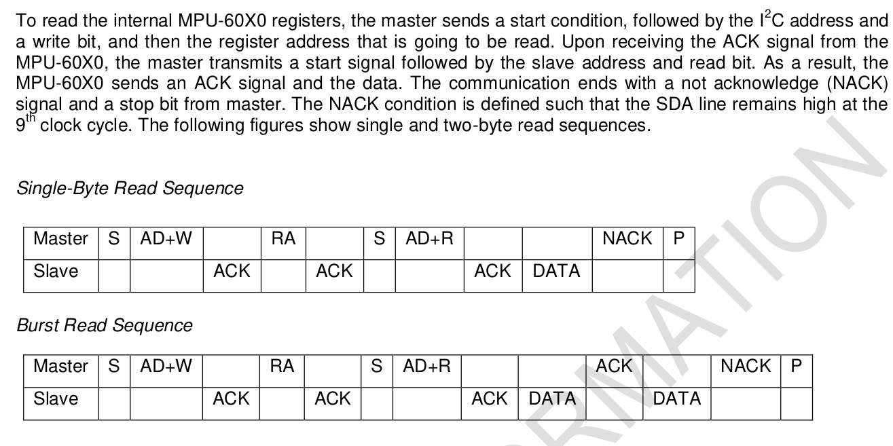
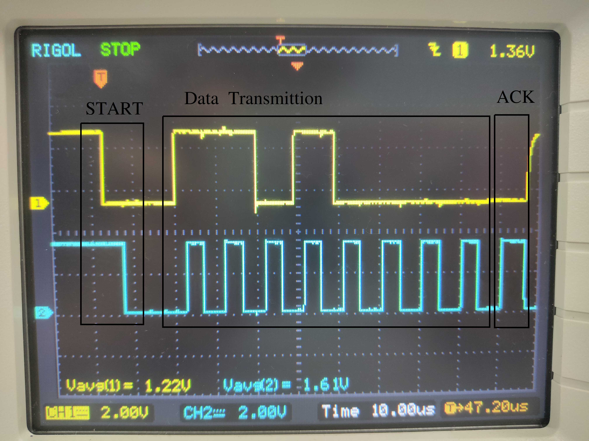
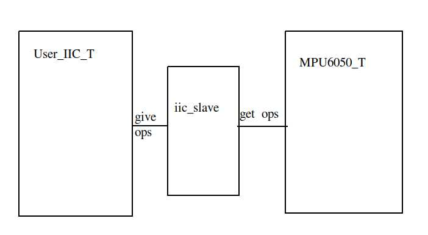
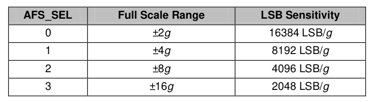
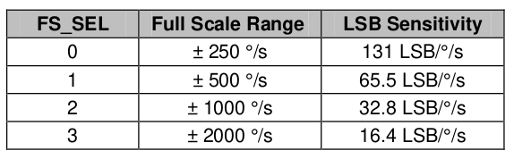

# 【C++开发MSP432】使用模拟IIC读取MPU6050数据

## 目录

1. IIC协议
   * 简介
   * 地址
   * 时钟控制
   * 数据传输
2. 代码结构
   * 分离、抽象
3. MPU6050数据处理
   * 温度
   * 加速度
   * 陀螺仪
   * 实例
4. Reference

## 一、IIC协议

* ### 简介

  IIC全称为Inter-Integrated Circuit，即内部集成电路线。它是一种串行的半双工总线，具有主从机的概念，在一般的单片机开发中，通常MCU作为主机，而其他使用IIC协议的传感器之类设备作为从机。物理接口为SDA和SCL两条线，其中SDA是Serial Data，即串行数据线，SCL为Serial Clock，即串行时钟线。空闲时，这两条线由于上拉电阻都呈现高电平。

* ### 地址

  在IIC总线上，每个IIC从机设备都有一个唯一的地址，而主机一般不需要设置自己的地址。通常这个地址是7位的，也有少数设备使用10位的地址。主机通过在SDA线上发送7位地址+1位读写位来选择设备，被选中的从机通过发送应答信号(Ack)来通知主机已准备就绪。之后主机就可以在总线上发送数据，没有被选中的从机不会对数据作出响应，此时IIC总线就相当于只连接了主机和被选中的从机。IIC协议规定最后一位读写位为0时，代表写操作，为1时代表读操作。

  mpu6050可以有两个从机地址，通过将AD0引脚接地或接Vcc来实现。

* ### 时钟控制

  SCL是由主机控制的，所以无论是主机向从机写数据或是从机向主机发送数据，都要根据主机生成的SCL来发送。主机应能自如地控制SCL的电平状态，以及SCL的速率，前者用于精准地读取数据以及生成信号，后者用于适配各种IIC设备对于SCL时钟的要求。一般来说IIC设备会在相应的User's Guide 或者device manual里找到对IIC时序的要求。

  mpu6050对IIC的时序要求可以在 _MPU-6000 and MPU-6050 Product Specification_ 里找到。

* ### 数据传输

  开始传输数据前，SDA线的控制权应为主机所有，主机为发起者，从机为应答者。举一个例子来说明传输过程：

  MSP432想读取MPU6050的_WHO_AM_I_寄存器的值。在这个例子中，MPU6050的地址为0x68；_WHO_AM_I_是MPU6050内部的寄存器，其在MPU6050内的地址为0x75。

  > 对于mpu6050，读取内部寄存器值的方法在_MPU-6000 and MPU-6050 Product Specification_里有详细的描述。简单来说，就是先发送起始信号(Start)和mpu6050的地址+写位（(0x68 << 1)|0 ，即0xD0），从机应答后再发送要读的内部寄存器的地址，从机应答后再发送起始信号和mpu6050的地址+读位（(0x68 << 1)|1 ，即0xD1），这时从机会应答并发送该寄存器的值，若这时主机发送不应答信号(NACK)并产生结束信号(STOP)，mpu6050就停止发送数据；若主机发送应答信号(ACK)，mpu6050会继续发送下一个寄存器（地址+1）的值，这个过程持续到主机发送不应答信号和结束信号为止。前者读数据的操作称为Single-Byte Read，后者称为Burst Read。
  >
  > 

  MSP432先产生一个START，再向总线上发送从机地址和读写位。可以看到从机的ACK。

  

  > START信号是SCL高电平时，SDA从高变低的信号。
  >
  > ACK信号即是SCL高电平时，SDA为低电平的信号。数据开始发送后的第九个SCL时钟采样的就是ACK信号，若此时SDA为低电平，即ACK，反之则为NACK。图中Data Transimittion中，SDA的控制权在MSP432，发完最后一位数据后，MSP432将SDA口设置为上拉输入，此时SDA由mpu6050掌控，可见mpu6050发送了ACK信号。

  从机ACK后，再向总线上发送内部寄存器地址（0x75），可见从机也ACK了。

  

  再向总线发送起始信号和从机地址加读位。可以看到从机ACK了。

  

  从机保持第一位数据的电平，直到第一个SCL脉冲结束。MSP432产生NACK信号和STOP信号来终止这次IIC通信。

  

  > STOP信号即SCL为高电平时，SDA由低到高的跳变。

  经过正确的时序发送数据，MSP432成功读到了 _WHO_AM_I_ 寄存器的值，为0x68。

  可见，在一次IIC通信的过程中，主机作为发起者需先产生一个START信号，并发送一个从机地址来选择从机，待从机应答后再作与从机的进一步通信。在这个例子中，在mpu6050的第一次应答后就是MSP432与mpu6050的通信，这时从整个IIC通信协议看，直到MSP432发送STOP信号之前都是所谓__数据传输阶段__，而根据mpu6050手册中的规定可知，在MSP432发送第二次从机地址后，总线上传输的数据才是我们真正想要的数据。

## 二、代码结构

* ### 分离、抽象

  代码结构采用面对对象的设计思想，定义了一个_User_IIC_T_的IIC控制类。类中实现了一些操作IIC适配器的方法，对外提供_write_、_read_、_init_等操作IIC的接口；其内部是以内联函数的形式实现_SDA_SET_、_SCL_SET_、_SDA_IN_等IIC总线基本操作，以及对这些内联函数的封装后便于调用的_iic_start_、_iic_stop_、_iic_send_byte_等函数。为了适配一条总线多个从机设备的情况，还实现了_add_slave_以及_select_slave_函数，用以添加和选择从机设备。

  在代码中，用户所使用的模拟IIC被抽象为一个类设备，这个类拥有一个从机链表，可以通过指定名字（字符串）来寻找一个IIC从机设备。将一个从机指定为当前从机后，这个类就会把IIC接口函数传递给该从机`struct iic_slave`，从而实现对IIC设备的读写操作。

  

  图中MPU6050_T是另一个描述从机设备的类，由用户自己定义。可见，整个工程将MSP432这边的IIC适配器与mpu6050划分开来。由于从机设备不可避免的需要操作IIC的方法，于是通过iic_slave这个结构体，IIC适配器可以向从机设备提供IIC操作方法，

## 三、MPU6050数据处理

* ### 温度

  MPU6050可以测量温度，且无须配置，在唤醒MPU6050后就可读取温度值。其测量值（RAW）存放在_TEMP_OUT_H_和_TEMP_OUT_L_中。读出H和L后将两个数结合为一个int16_t的整型值（H << 8 | L），再通过手册中给出的公式即可计算得到温度(degrees C)。

  > 手册原文为：
  >
  > _The temperature in degrees C for a given register value may be computed as:
  > Temperature in degrees C = (TEMP_OUT Register Value as a signed quantity)/340 + 36.53_
  >
  > 即：温度值 = 16位寄存器值 / 340 + 36.53
  >
  > 注意：16位寄存器值在计算时应作为有符号数，温度值也要定义为float或double型。

* ### 加速度

  要使用MPU6050测量加速度值，首先要知道加速度计的量程，若不对_ACCEL_CONFIG_寄存器进行配置，则默认量程为-2g~+2g，共4g宽度。在此工程中则配置为-8g~+8g，共16g宽度。由于mpu6050每个轴存放加速度值结果的寄存器_ACCEL_XOUT_H_和_ACCEL_XOUT_L_加起来只有16bit，故最大测量值是2^16=65536，则每1个g用65536/__16__=4096来表示，这里的__16__是量程的宽度。例如：x轴输出为8192，则代表x轴方向有8192/4096=2g的加速度值。

  

  

  

* ### 陀螺仪

  陀螺仪测量的是角速度，单位为deg/s。同样，要计算角速度值，就要知道陀螺仪的量程。在此工程中配置量程为-500deg/s~+500deg/s，可计算得到每65.5代表1deg/s，也可以直接看手册中的表格。

  

  与加速度值的处理类似，只要将高低两个寄存器的值结合，再除以根据量程计算出的数，就可以得到角速度值。

* ### 实例

  贴出程序中一段处理数据的代码。

  ```C++
  /** measure 是一个存放所读取到数据的数组，从0~13依次是加速度xyz轴6个寄存器值，温度2个寄存器值和陀螺仪xyz轴6个寄存器值 
   *	accel_LSB和gyro_LSB分别对应加速度计和陀螺仪所选量程对应的LSB值
   */
  	rdata.Accel_X_RAW = measure[0] << 8 | measure[1];
      rdata.Accel_Y_RAW = measure[2] << 8 | measure[3];
      rdata.Accel_Z_RAW = measure[4] << 8 | measure[5];
      int16_t tmp = measure[6] << 8 | measure[7];
      rdata.Gyro_X_RAW = measure[8] << 8 | measure[9];
      rdata.Gyro_Y_RAW = measure[10] << 8 | measure[11];
      rdata.Gyro_Z_RAW = measure[12] << 8 | measure[13];
  
      /* computing accel, gyro and temperature */
      rdata.Ax = (double)(rdata.Accel_X_RAW) / accel_LSB[m_accel_fsr];
      rdata.Ay = (double)(rdata.Accel_Y_RAW) / accel_LSB[m_accel_fsr];
      rdata.Az = (double)(rdata.Accel_Z_RAW) / accel_LSB[m_accel_fsr];
  
      rdata.Temperature = tmp/340.0f + 36.53f;
  
      rdata.Gx = (double)(rdata.Gyro_X_RAW) / gyro_LSB[m_gyro_fsr];
      rdata.Gy = (double)(rdata.Gyro_Y_RAW) / gyro_LSB[m_gyro_fsr];
      rdata.Gz = (double)(rdata.Gyro_Z_RAW) / gyro_LSB[m_gyro_fsr];
  ```

## 四、Reference

[MPU-6000 and MPU-6050 Register Map and Descriptions Revision 4.2](https://invensense.tdk.com/wp-content/uploads/2015/02/MPU-6000-Register-Map1.pdf)

[MPU-6000 and MPU-6050 Product Specification Revision 3.3](https://www.haoyuelectronics.com/Attachment/GY-521/mpu6050.pdf)

[leech001's code](https://github.com/leech001/MPU6050)

[MSP432P4xx SimpleLink™ Microcontrollers Technical Reference Manual](https://usermanual.wiki/Document/usersguide.610306342)

